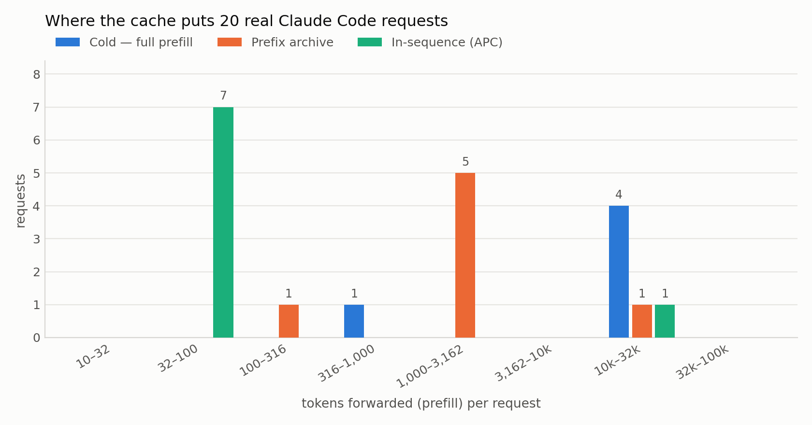
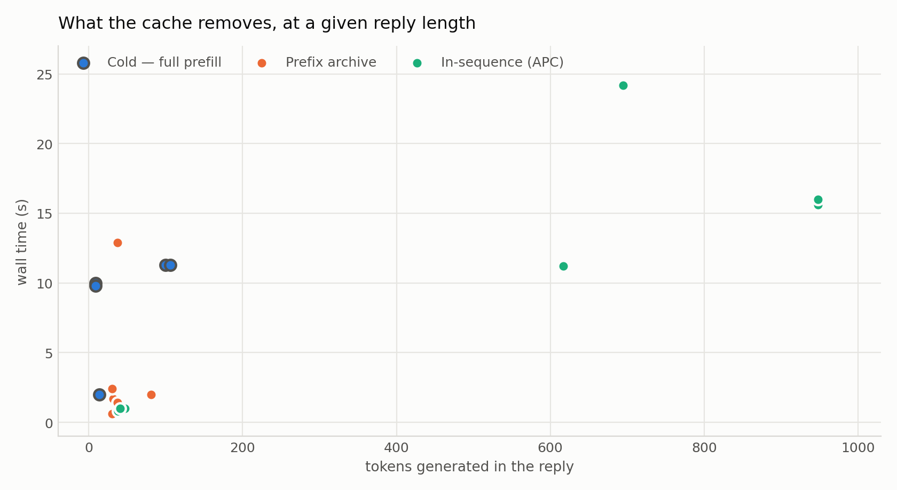
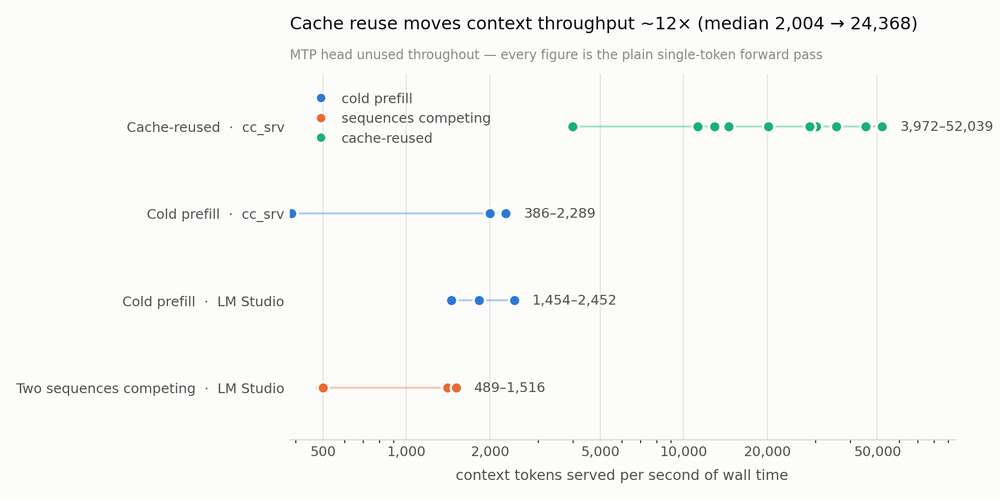

# cc_srv

llama.cpp 的 Anthropic-Messages 后端。把 Claude Code 指过来，本地模型就是那个
agent。

整个设计只利用 agent 会话的一个性质：**每个请求的提示词，都是上一个请求的提示词再
加上几个 token。** 四层缓存都围绕这一点，按代价从低到高排列。

一次真实会话实测，20 个请求，单张 RTX 5060 Ti：**15 个命中缓存层，591,946 个提示词
token 里有 447,657 个（75.6%）根本没有转发给模型。** 配置是
`CC_ARCHIVE=1 CC_BATCH=1 CC_BATCH_N=3`，即 4 个序列、`n_ctx` 524288。archive 与
草稿缓存互斥，所以本节所有测量都是在投机解码关闭的情况下做的。

---

## 快速开始

**先改 `lib.py`。** 顶部两个路径：`DLL` 放你的 llama.cpp 动态库，`GGUF` 是你的对话
模型。两个都指向开发这台机器。

```powershell
python run.py --port 8788 --n-ctx 131072
curl.exe http://127.0.0.1:8788/health     # {"ok": true}
```

```powershell
claude --settings D:/path/to/cc_srv/_cc_local.json
```

`--settings` 是必须的，不是风格问题。Claude Code 2.1.270 里，settings 文件的 `env`
块优先于进程环境变量，所以 `$env:ANTHROPIC_BASE_URL=...; claude` 会继续跟你
`~/.claude/settings.json` 里原本指向的服务说话。

**`_cc_local.json` 里的 `UserPromptSubmit` 命令也要改。** 它写死了这台机器的 Python
和 `cc_hook.py` 的绝对路径。路径失效，这个 hook 会在你每一条输入上触发并失败。
不需要记录提示词就直接删掉整个 `hooks` 块。

请求都落在 `logs/server.log`：

```
2026-09-13 20:22:53 [INFO ] [req] req 52039+41 batch_apc pre=77 reuse=51962 p_raw=- cur=52079 1.0s (prefill 0.0s + decode 0.0s) turn=text:e24e0fc8 seq=0
```

52,039 token 的提示词，其中 51,962 由缓存回答，实际转发 77 个，耗时 1.0 秒。批处理
路径上 prefill/decode 的拆分读数是零，只有总数是真的。

---

## 缓存对一次会话做了什么

两张图都是那 20 个请求，颜色表示服务该请求的层。



冷启动转发完整提示词，中位数 **22,641 token**。archive 留有状态的请求转发
**1,232**。延续 KV 中已有序列的请求转发 **71**。



回复长度是缓存碰不到的那部分。以它为横轴，冷启动请求（带圈）在每一个长度上都位于
缓存请求上方，落差就是它们付出的 prefill。爬上去的那两个缓存点（11 秒、24 秒）是
600 到 950 token 的长回复，缓存缩短不了。

回复长度在 30 到 106 token 之间时：

| 由谁服务 | 回复 token | 转发的 prefill | 墙钟时间 |
|---|---:|---:|---:|
| 冷启动 | 100 | 22,646 | 11.3 s |
| 冷启动 | 106 | 22,641 | 11.3 s |
| 前缀 archive | 81 | 1,055 | 2.0 s |
| 前缀 archive | 32 | 2,324 | 1.7 s |
| 前缀 archive | 37 | 1,048 | 1.4 s |
| 前缀 archive | 30 | 170 | 0.6 s |
| 序列内 | 41 | 77 | 1.0 s |
| 序列内 | 41 | 66 | 0.9 s |

**81 个回复 token 用 2.0 秒，对 100 个回复 token 用 11.3 秒。** 最短的缓存回复都在
一秒内返回。

---

## 吞吐

每秒墙钟时间服务的上下文 token 数，两侧同一个公式。冷启动的墙钟时间几乎全是
prefill，缓存请求的绝大部分是生成，**所以缓存那一列是偏保守的**。



| | 中位上下文 tok/s |
|---|---:|
| 冷启动 prefill，`cc_srv` | 2,004 |
| 冷启动 prefill，LM Studio | 1,832 |
| 两个序列竞争，LM Studio | 956 |
| **缓存复用，`cc_srv`** | **24,368** |

中位数约 12 倍。复用那一侧从 3,972 到 52,039：低端是一个 51,244 token 的提示词，
archive 没有它的分叉点，照样转发了 22,677 token，即便如此仍击败图上每一个冷启动
请求；高端复用了 99.9% 的上下文。

表里是那次会话中生成 ≤106 token 的 15 个请求，两侧墙钟时间都由 prefill 主导。生成
617 到 948 token 的 5 个没进表，它们的墙钟时间是生成。引擎日志里另有六次冷启动
prefill，提示词 11,589 到 71,070 token，独立落在 1,846 到 2,318 tok/s。

两个说明都是关于这些数字**不是**什么：

- **不是 MTP。** 模型带多 token 预测头，本引擎从不启用——`lib.py` 里的 `mtp` 保持
  llama.cpp 的默认值，即关闭。每个数字都是普通单 token 前向。
- **不是跟调优过的基线比。** LM Studio 那几行是同一张卡、同一个 GGUF，没有缓存栈。
  在那条基线内部，两个序列并发几乎让 prefill 吞吐减半（1,832 降到 956 tok/s）。这
  正是这里批处理只在延迟上赢、不在吞吐上赢的原因。

---

## 工作原理

| 层 | 触发条件 | 代价 |
|---|---|---|
| **Logits 缓存** | 提示词逐 token 相同 | 无前向、无 KV |
| **轨迹召回** | 提示词是某条已记录轨迹的前缀 | 无前向、无 KV |
| **轮次键复用** | 结尾的用户轮次之前被回答过 | 无前向、无 KV |
| **APC** | 任意公共前缀 | 只转发新增部分 |
| 冷启动 | 其余一切 | 完整 prefill |

前三层返回的 token 没有任何东西被重算。长会话里省下的主要来自 APC，因为一个对话的
提示词就是上一个提示词加几个 token。

**轮次键复用。** Logits 缓存以整个提示词为键，在对话内部几乎从不触发：每一轮都追加
了上一轮问答。改用结尾的用户轮次作键，重复提问才变得可回答。`CC_QREUSE=1` 匹配同一
对话里的同一个问题；`CC_QREUSE=2` 配合 `CC_QEDIT=1` 还会跨对话匹配一个**相似**的
问题并改写旧回复。每个生成 token 背后保留一份 top-k logits 轨迹，通过 argmax 重放，
重放的 token 不需要前向；而改写所做的每一次替换，都对着模型自己在该位置的缓存
top-k 校验过。

**Claude Code 提示词里有三样东西会毁掉前缀缓存。** 三样都处理了：

- 提示词里带 `<total_tokens>N tokens left</total_tokens>`，而 `N` 每个请求都变，
  前缀就断在它第一次出现的位置。服务端做了归一化，`_cc_local.json` 另外设了
  `CLAUDE_CODE_TOTAL_TOKENS_REMINDER=infinite`，让它干脆不再变化。
- 生成时用的助手头，必须和重渲染历史时用的逐字节一致。它取自模型自己的 chat
  template，而不是写死的换行。
- 助手消息通常带一个空文本块。朴素拼接会把它变成两个多余换行，光这一项就足以清零
  上千 token 的复用。这些块被丢掉。

### 前缀之外

**前缀 archive。** 兄弟 subagent 共享长前缀，但彼此不是对方的延续，普通前缀缓存帮
不上。archive 在请求**真正分叉**的点上保存整个 KV 状态，后来有请求要时整块恢复。
上面那次会话里它服务了 20 个请求中的 7 个；最清楚的一个是 24,775 token 的提示词只
转发了 **2,324** 个，另外 22,451 个已经在归档状态里。

**批处理服务。** 一次 9B Q4 解码步不管产出多少 token 都要把 5.5 GB 权重整个读一遍，
所以同一次读可以同时推进多个序列。`CC_BATCH=1` 时并发请求共享一次前向：解码吞吐是
逐个服务的 3.3 倍。

**投机解码。** `CC_DDC` 复用模型已经产出过的延续，再批量验证。草稿来自上下文本身，
唯一代价是验证；草稿落地时一轮约快 3 倍，不落地时是净亏。所以由**两道闸门**决定它
什么时候运行。

第一道按草稿长度分桶，逐桶跟逐 token 解码比。某次实测中 2 到 3 token 的草稿跑到
0.56 倍，被丢掉；16+ token 的跑到 3.3 倍，保留。

第二道问的是内容到底有没有在重复。建草稿索引要在每个已提交 token 上做一次全词表
扫描，实测占生成时间的 **7.9%**，而它只在草稿能落地时才回本。所以**生成出的 token
流一旦停止重复，DDC 让开；一旦开始重复，恢复。** 三个提示词，tok/s：

| | 普通 | 普通 | 重复 |
|---|---:|---:|---:|
| `CC_DDC=0` | 69.2 | 69.8 | 69.6 |
| DDC 开，闸门关（`CC_SPEC_GOV=0`） | 58.1 | 59.0 | 128.8 |
| **DDC 开，闸门生效（默认）** | **66.6** | **67.9** | **141.5** |

非重复内容上 13% 的代价降到 3%，重复内容上 2.0 倍的收益保住。

两个限制：

- **`CC_DDC_MAX_CTX` 默认 32,768。** 超过这个提示词长度草稿缓存自行让开：长上下文
  流量上它实测 0.712 倍，比逐 token 解码还慢。Claude Code 上下文常年在 25k 到 50k，
  所以预期它在小轮次上生效、大轮次上退位。设 `0` 表示不限制。
- **不能和 archive 同时跑。** DDC 在序列 1 上验证草稿并每轮清空它，而 archive 把状态
  存在同一批备用序列里。`CC_ARCHIVE=1` 时 DDC 让位；两个都点名设置会被直接拒绝，
  而不是冒着静默损坏的风险。

---

## 配置

全部是环境变量。

**默认开启：**

| 变量 | 默认 | 作用 |
|---|---|---|
| `CC_DDC` | 4 | 草稿缓存键宽；`0` 关闭。代价是一个备用序列，`n_ctx` 翻倍，131072 时 KV 从 1.2 涨到 2.4 GB |

**可选：**

| 变量 | 默认 | 作用 |
|---|---|---|
| `CC_ARCHIVE=1` | 关 | 前缀 archive。代价是一个备用序列，且排除 `CC_DDC`（DDC 为它让位） |
| `CC_QREUSE=1` | 关 | 复用对重复用户轮次的回复 |
| `CC_BATCH=1` | 关 | 并发请求走一个批次，规模由 `CC_BATCH_N` 定 |

**调优：**

| 变量 | 默认 | 作用 |
|---|---|---|
| `CC_ARCHIVE_SLOTS` | 1 | archive 保留几个序列 |
| `CC_ARCHIVE_MIN` | 512 | 短于这个长度的前缀不值得归档 |
| `CC_BATCH_N` | 4 | worker 序列数，即并发请求数 |
| `CC_BATCH_WAIT` | 512 | 为免等最忙的 worker，愿意让出的前缀 token 数 |
| `CC_DDC_M` | 32 | 草稿长度上限；通常先卡住的是截断阈值 |
| `CC_DDC_T` | 0.5 | 草稿截断阈值，越低草稿越长。`M=32/T=0.5` 时每轮 15 到 22 token |
| `CC_DDC_MAX_CTX` | 32768 | 超过这个提示词长度草稿缓存让开；`0` 表示不限 |
| `CC_SPEC_GOV` | 1 | 闸门；`0` 表示只要有草稿就投机 |
| `CC_SPEC_MIN` | 12 | 判定某个草稿长度前需要的轮次证据 |
| `CC_SPEC_COOLDOWN` | 64 | 被丢掉的长度多久后重测；每次翻倍 |
| `CC_SPEC_REP_MIN` | 0.15 | 重复率下限，低于它 DDC 让开 |
| `CC_SPEC_REP_GRACE` | 128 | DDC 可以让开之前，每轮生成的宽限 token 数 |
| `CC_QEDIT` | 关 | 保留二级复用改写所依据的 top-k 轨迹 |
| `CC_QEDIT_SIM` | 0.9 | 二级轮次的相似度下限 |
| `CC_QREUSE_TOOL` | 0 | 允许复用对工具结果的回复；见下 |
| `CC_STREAM` | 1 | 模型还在生成时就开始流式输出 |
| `CC_LOG` | `info` | `debug` / `info` / `warn` / `error` / `off` |
| `CC_LOGDIR` | `./logs` | `server.log` 和 `requests.jsonl` 放哪 |

archive 和批处理一起开：

```powershell
$env:CC_ARCHIVE='1'
$env:CC_QREUSE='1'
$env:CC_BATCH='1'; $env:CC_BATCH_N='3'
python run.py --port 8788 --n-ctx 131072
```

`n_ctx` 会乘以序列数，好让每个序列保住完整窗口：3 个 worker 加 1 个 archive 槽就是
`n_ctx` × 4，131072 时约 4.8 GB KV。卡紧张就把 `--n-ctx` 调小。

### 什么时候该关掉某一层

- **轮次键复用**用模型之前对同一个问题的回复来作答。对话被重放、或问题确实重复时
  这是对的，但它是**语义选择而非正确性证明**：没有任何东西在当前上下文下重新推导
  那个回复。锋利的是二级。Claude Code 的问题共享太多模板话术，两个**真正不同**的
  问题相似度约 0.65，而在 0.6 的下限上，它在一个真实对话的 18 个请求里有 10 个拿
  一个问题的答案去回答另一个，把对话带崩了。下限现在默认 0.9，且差异中没有任何可
  替换项时会被拒绝。需要每个回复都在当前上下文下产生，就把 `CC_QREUSE` 留在 0。
- **复用对工具结果的回复**（`CC_QREUSE_TOOL=1`）默认关闭，因为这类回复通常包含产生
  该结果的**工具调用**本身，重放它就会重新发起调用，对话陷入循环。
- **批处理服务**改变图形态，回复可能与单序列路径不同。约一半的提示词在某处发生分歧，
  而且是确定性的：引擎有记录的批处理对顺序执行的数值差异，不是竞态。需要回复与单
  序列服务端一致就别开 `CC_BATCH`。
- **投机解码**只在草稿落地时才划算：重复的代码、重复的工具调用、反复读同一个文件。
  闸门在别处会关掉它，所以关掉它的常见理由不是速度，而是**确定性**。一轮投机走的是
  不同的数值路径，需要回复与纯单 token 服务端逐位一致就设 `CC_DDC=0`。
- **前缀 archive**（`CC_ARCHIVE=1`）是唯一一个会替你关掉 DDC 的设置，因为两者需要
  同一批备用序列。

---

## 文件

```
run.py         入口
srv.py         HTTP 层、Claude Code 适配器、请求日志
eng.py         引擎：KV、APC、logits 缓存、召回、archive
batch.py       调度器：多请求，每步一次前向
qcache.py      轮次键复用与 argmax logit 重放
spec.py        投机解码的两道闸门：草稿长度，以及内容到底有没有在重复
ddc.py         余量感知的草稿缓存
ddc_decode.py  目标模型验证式草稿解码
stream.py      模型还在生成时就开始流式输出
log.py         统一日志，包含 llama.cpp 自己的 C 层输出
cc_hook.py     捕获你输入的提示词的 Claude Code hook
lib.py         加载 llama.cpp 动态库
```

需要 CUDA 构建的 llama.cpp（动态库从 `lib.py` 里的路径加载）和 GGUF 对话模型。全部
在 RTX 5060 Ti 16 GB 上、用 Qwythos-9B-v2-MTP Q4_K_M 配 Q4_0 KV 开发和测量，由
Claude Code 2.1.270 驱动。
